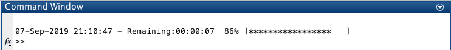
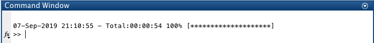
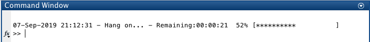
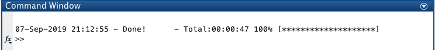
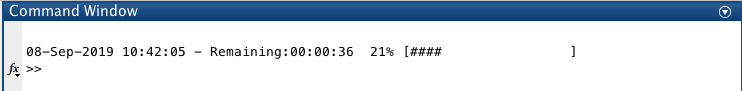
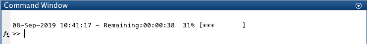
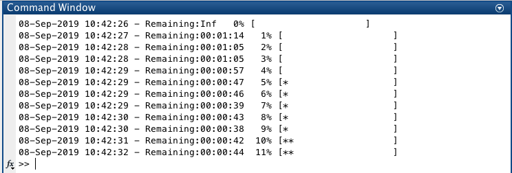
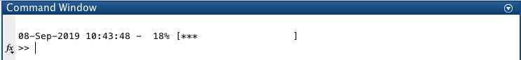
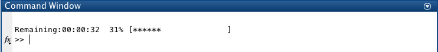
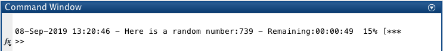

# Summary
`parwaitbar` is a Matlab class that displays a progress bar compatible with for/parfor loops.

If `parallel.pool.DataQueue` is available, `parwaitbar` uses the queue to update the waitbar asynchronously.
If `parallel.pool.DataQueue` is unavailable, `parwaitbar` creates a temporary text file, saved in the current folder, to communicate information between workers. The file is deleted when the last task is completed.

# Basic usage
Use `parwaitbar(N)` to initialize the waitbar for `N` tasks. Use the `progress()` method to advance the progress of the waitbar:
```matlab
N = 100;
wb = parwaitbar(N);
  parfor i=1:N
    ...
    wb.progress();
  end
```


After completion, the waitbar displays the total time taken to complete all tasks and deletes the `parwaitbar` object:


# Basic customization
* Change the waiting message with the `WaitingMessage` keyword:
```matlab
wb = parwaitbar(...,'WaitMessage','Hang on ...')
```


* Change the final message with the `FinalMessage` keyword:
```matlab
wb = parwaitbar(...,'FinalMessage','Done !')
```


# Advanced customization
* Change the marker used for filling the bar.
```matlab
wb = parwaitbar(...,'Marker','#')
```


* Change the progress bar Length
```matlab
wb = parwaitbar(...,'BarLength',10)
```


* Do not overwrite previous bar updates.
```matlab
wb = parwaitbar(...,'Overwrite',false)
```


* Hide the remaining time.
```matlab
wb = parwaitbar(...,'RemainingTime',false)
```


* Hide the current date.
```matlab
wb = parwaitbar(...,'Date',false)
```


* Display update messages using `progress()` inputs.
```matlab
wb.progress(sprintf('Here is a random number:%d',randi(1000)))
```


# Compatibility
Tested on:
* Matlab 2019a on OS X Sierra (10.12)
* Matlab 2018b on Ubuntu, 16.04.5 LTS

# To do
* Add option to use Matlab's native waitbar
* Add option to change the update file folder name
* Test compatibility on Windows and previous Matlab releases.
